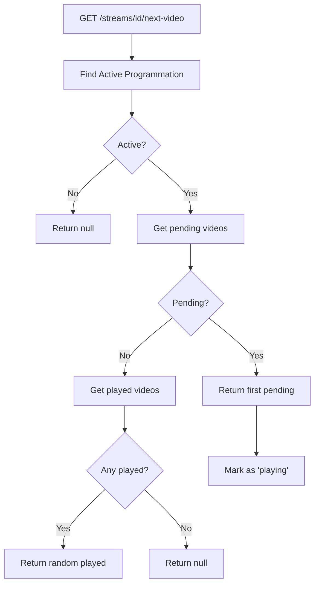

# Streaming Infrastructure

This document describes the OBS streaming infrastructure architecture.

## Overview

The streaming module provides database-driven video scheduling and playback for OBS (Open Broadcaster Software). It replaces the previous RabbitMQ-based approach with a REST API-driven architecture.

## Architecture

```
┌─────────────────────────────────────────────────────────────────────────┐
│                         STREAMING STACK                                  │
│  ┌──────────────┐    ┌─────────────────┐    ┌──────────────────────┐   │
│  │ Twitch Chat  │───▶│ Virtual Streamer│───▶│   MySQL Database     │   │
│  │   Reader     │    │      API        │    │  (Playlists, etc.)   │   │
│  └──────────────┘    └─────────────────┘    └──────────────────────┘   │
│                              │                         │                │
│                              │                         │                │
│                              ▼                         ▼                │
│                      ┌───────────────┐         ┌──────────────┐        │
│                      │    MinIO      │         │ Video Server │        │
│                      │   (Videos)    │◀────────│   (Proxy)    │        │
│                      └───────────────┘         └──────┬───────┘        │
│                                                       │                 │
│                                                       ▼                 │
│                                               ┌──────────────┐         │
│                                               │     OBS      │         │
│                                               │ (Browser Src)│         │
│                                               └──────────────┘         │
└─────────────────────────────────────────────────────────────────────────┘
```

## Core Concepts

### StreamConfig

A stream configuration represents a single streaming instance (e.g., a Twitch channel).

```python
class StreamConfig:
    stream_id: str      # Unique identifier (e.g., "ai_jesus")
    name: str           # Display name
    description: str    # Optional description
    is_active: bool     # Whether the stream is active
```

### MediaProgrammation

A programmation defines a time-based schedule linking to a StoryTemplate.

```python
class MediaProgrammation:
    programmation_id: str
    stream_id: str           # Parent stream
    story_template_id: str   # Template for video generation
    name: str                # Display name (e.g., "News Hour")
    start_time: time         # Daily start (e.g., 12:00)
    end_time: time           # Daily end (e.g., 13:00)
    priority: int            # Higher wins on overlap
    is_active: bool
```

**Time Slot Behavior:**
- Programmations define daily recurring time slots
- If multiple programmations overlap, the one with higher priority wins
- Gaps in the schedule are allowed (returns "no_active_programmation")

### PlaylistEntry

A video in a programmation's playlist.

```python
class PlaylistEntry:
    entry_id: str
    programmation_id: str     # Parent programmation
    video_storage_key: str    # MinIO storage key
    status: PlaylistStatus    # pending, playing, played, skipped
    play_order: int           # Order within playlist
    metadata: dict            # Additional info
    played_at: datetime       # When last played
```

**Status Flow:**
```
pending → playing → played
            ↑         │
            └─────────┘ (replay as fallback)
```

## Video Selection Algorithm

When the video server requests the next video:



**Priority Order:**
1. Pending videos (by `play_order`, then `created_at`)
2. Random from played videos (replay/fallback)

## API Endpoints

### Stream Management

| Endpoint | Method | Purpose |
|----------|--------|---------|
| `/api/v1/streams` | GET | List all streams |
| `/api/v1/streams` | POST | Create stream |
| `/api/v1/streams/{id}` | GET | Get stream |
| `/api/v1/streams/{id}` | PUT | Update stream |
| `/api/v1/streams/{id}` | DELETE | Delete stream |

### Programmation Management

| Endpoint | Method | Purpose |
|----------|--------|---------|
| `/api/v1/streams/{id}/programmations` | GET | List programmations |
| `/api/v1/streams/{id}/programmations` | POST | Create programmation |
| `/api/v1/streams/{id}/programmations/active` | GET | Get active programmation |
| `/api/v1/programmations/{id}` | GET | Get programmation |
| `/api/v1/programmations/{id}` | PUT | Update programmation |
| `/api/v1/programmations/{id}` | DELETE | Delete programmation |

### Playlist Management

| Endpoint | Method | Purpose |
|----------|--------|---------|
| `/api/v1/programmations/{id}/playlist` | GET | List playlist entries |
| `/api/v1/programmations/{id}/playlist` | POST | Add video to playlist |
| `/api/v1/streams/{id}/next-video` | GET | Get next video (main endpoint) |
| `/api/v1/playlist/{id}/played` | POST | Mark video as played |

## Components

### Video Server (`streaming/video_server/`)

A minimal FastAPI application that:
- Proxies requests to the main API
- Serves static HTML for the video player
- Contains **zero business logic**

```python
# All it does is forward requests
@app.get("/api/next")
async def get_next():
    async with httpx.AsyncClient() as client:
        resp = await client.get(f"{API_URL}/api/v1/streams/{STREAM_ID}/next-video")
        return JSONResponse(content=resp.json())
```

### HTML Player (`streaming/video_server/static/index.html`)

A simple HTML5 video player that:
1. Fetches next video from `/api/next`
2. Plays the video
3. Marks as played when ended
4. Loops to step 1

Features:
- Exponential backoff on errors
- Overlay showing current programmation
- Replay indicator for fallback videos

### Twitch Chat Reader (`streaming/twitch/`)

Reads Twitch chat and submits questions to the API:
1. Connects to Twitch IRC
2. Listens for `!allo` commands
3. Submits video generation requests to API
4. Videos are automatically added to playlist on completion

## Docker Setup

### Compose File: `compose_streaming.yml`

```yaml
services:
  video_server:
    build: ./docker/streaming/video_server
    ports: ["5000:5000"]
    environment:
      - API_URL=http://virtual_streamer_api:8000
      - STREAM_ID=default
    networks:
      - streaming

  obs:
    build: ./docker/streaming/obs
    ports:
      - "5901:5901"   # VNC
      - "6901:6901"   # noVNC
      - "4455:4455"   # WebSocket
    networks:
      - streaming

networks:
  streaming:
    external: true
    name: vs_streaming
```

### Network Setup

The streaming stack uses a shared network to communicate with the main services:

```bash
# Create network
docker network create vs_streaming

# Connect main services
./scripts/setup_streaming_network.sh
```

## Database Schema

```sql
CREATE TABLE stream_configs (
    stream_id VARCHAR(64) PRIMARY KEY,
    name VARCHAR(255) NOT NULL,
    description TEXT,
    is_active BOOLEAN DEFAULT TRUE,
    created_at TIMESTAMP DEFAULT CURRENT_TIMESTAMP,
    updated_at TIMESTAMP DEFAULT CURRENT_TIMESTAMP ON UPDATE CURRENT_TIMESTAMP
);

CREATE TABLE media_programmations (
    programmation_id VARCHAR(36) PRIMARY KEY,
    stream_id VARCHAR(64) NOT NULL,
    story_template_id VARCHAR(36) NOT NULL,
    name VARCHAR(255) NOT NULL,
    start_time TIME NOT NULL,
    end_time TIME NOT NULL,
    priority INT DEFAULT 0,
    is_active BOOLEAN DEFAULT TRUE,
    created_at TIMESTAMP DEFAULT CURRENT_TIMESTAMP,
    FOREIGN KEY (stream_id) REFERENCES stream_configs(stream_id) ON DELETE CASCADE
);

CREATE TABLE playlist_entries (
    entry_id VARCHAR(36) PRIMARY KEY,
    programmation_id VARCHAR(36) NOT NULL,
    video_storage_key VARCHAR(512) NOT NULL,
    status ENUM('pending', 'playing', 'played', 'skipped') DEFAULT 'pending',
    play_order INT DEFAULT 0,
    metadata JSON,
    created_at TIMESTAMP DEFAULT CURRENT_TIMESTAMP,
    played_at TIMESTAMP NULL,
    FOREIGN KEY (programmation_id) REFERENCES media_programmations(programmation_id) ON DELETE CASCADE
);
```

## Usage

### Quick Start

```bash
# 1. Setup database tables
python scripts/setup_streaming_tables.py

# 2. Seed test data
python scripts/seed_streaming_data.py

# 3. Start main services
docker compose up -d

# 4. Setup network
./scripts/setup_streaming_network.sh

# 5. Start streaming stack
docker compose -f compose_streaming.yml up -d
```

### Creating a Programmation via API

```bash
# Create a stream
curl -X POST http://localhost:8000/api/v1/streams \
  -H "Content-Type: application/json" \
  -d '{"stream_id": "my_stream", "name": "My Stream"}'

# Create a programmation (24/7)
curl -X POST http://localhost:8000/api/v1/streams/my_stream/programmations \
  -H "Content-Type: application/json" \
  -d '{
    "story_template_id": "cest_pas_sorcier",
    "name": "All Day",
    "start_time": "00:00:00",
    "end_time": "23:59:59",
    "priority": 0
  }'

# Add a video to the playlist
curl -X POST http://localhost:8000/api/v1/programmations/{prog_id}/playlist \
  -H "Content-Type: application/json" \
  -d '{"video_storage_key": "generated_videos/my_video.mp4"}'
```

### Accessing the Player

- **Video Player**: http://localhost:5000
- **VNC (OBS)**: vnc://localhost:5901
- **noVNC (Web)**: http://localhost:6901

## Migration from Old System

The old system used:
- RabbitMQ for video notifications
- AWS S3 for storage
- Flask for the video server
- Hardcoded character configuration

The new system uses:
- MySQL database for playlists
- MinIO (S3-compatible) for storage
- FastAPI for all services
- Configurable streams and programmations

### Deprecated Files

These files have deprecation warnings and will be removed:
- `apps/obs_video_server.py` → Use `streaming/video_server/app.py`
- `virtual_streamer/twitch/chat_reader.py` → Use `streaming/twitch/chat_reader.py`
- `assets/test.html` → Use `streaming/video_server/static/index.html`
